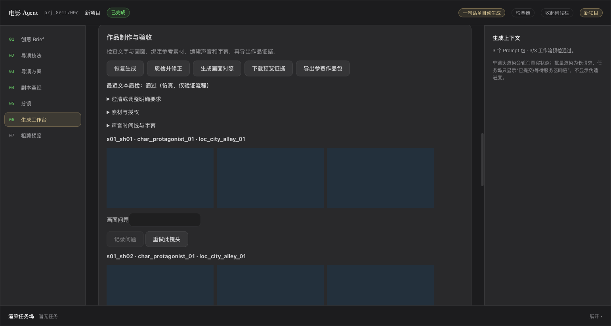

# 本轮验证记录

## 工程验证

- 后端完整回归：44 passed，两个现有依赖弃用提示，无失败。
- 前端：TypeScript 检查及 Vite 构建通过。
- Python 3.10：源码语法检查通过；实际回归使用本地 Python 3.11。
- Notebook：全部代码单元语法检查通过；其调用的回归与评测命令已实际执行，未单独启动 Jupyter 内核。

## 36 次固定输入仿真

每组 12 条，其中 3 条预期要求澄清。

| 组别 | 生成成片 | 符合预期行为 |
| --- | --- | --- |
| baseline | 9/12 | 12/12 |
| rules | 7/12 | 10/12 |
| full | 7/12 | 10/12 |

**这不是质量提升率。** 基线允许两个多人样例使用单人仿真剧本继续生成；规则和完整组正确发现了角色数量不符。仿真没有提供这两个内容修复样例，因此保留失败，未捏造修正成功。局部修复成功、越界阻止和两轮上限由故障注入测试验证。真实 LLM 下的修复率待实测。

60 秒输出最初发现逐镜头帧数取整累计误差，已修复并复测通过。逐例指标与原始失败原因见 [仿真报告](evaluation-simulation.json)。此次评测为本轮开发过程的运行快照，真实服务、艺术质量和成本均未验证。

## 浏览器实操

使用独立临时项目，完成：一句话创建 → 缺首帧明确失败 → 上传默认参考图 → 恢复生成 → 9 张起中末对照帧 → 上传音乐 → 添加时间线 → 编辑字幕 → 合成 → 下载证据 ZIP。

下载结果经 FFprobe 独立确认：10.000 秒，含 video、audio、subtitle 三种流。测试画面为纯色，音频为合成音，绝不是参赛作品质量示例。

## 待实际验收

- 既有真实 ComfyUI / ModelScope 服务上的生成与远端恢复。
- 真实 LLM 内容审阅和修复成功率。
- 人物视觉一致性、叙事和声音的人工盲评。
- 一部使用确认授权素材的真实完整参赛作品。

## 魔搭分支合并验证（2026-09-14）

合并空间 `b5a49c6` 的六个独有提交与 GitHub `274ae78`。保留幕间命名、导演模板、原生 Wan UI/API 导出、启动迁移和持久化目录。网页默认制作包流程使用 `render=false`，一句话成片使用 `render=true`；SDK 保留自动生成默认行为，网页确认接口显式 `generate=false`。

合并回归：全量执行 66 通过、1 失败；修正该测试对仿真规则模式的调用后定向执行 1 通过。前端 TypeScript 与 Vite 构建通过。双人仿真案例明确验证约束不通过，不计为真实生成成功。历史评测报告对应合并前版本，不代表新版本实测。
